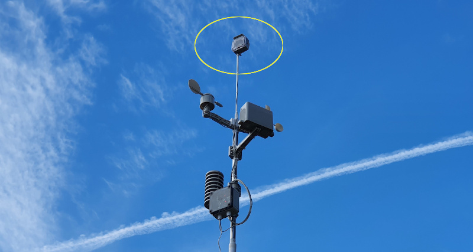
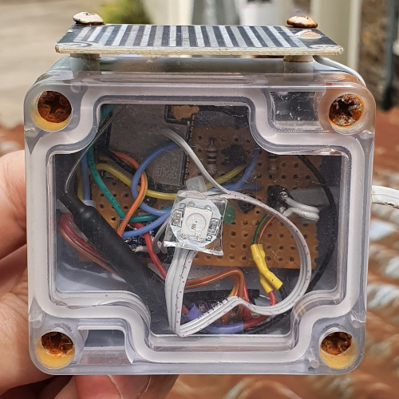
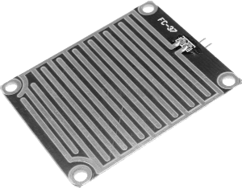
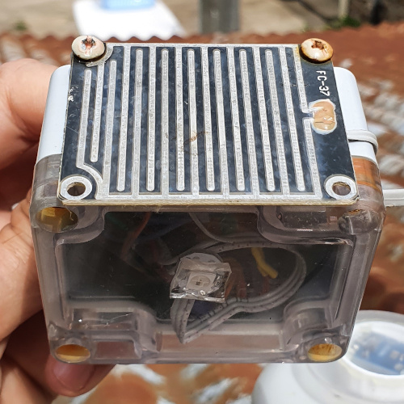

# Détecteur de pluie pour ESPHome

Read this in other language: [English](README.md)



## Présentation

Suite au développement de la [station météo à base d'ESPHome](https://github.com/hugokernel/esphome-weather-station), j'ai souhaité
avoir un système permettant de détecter le plus rapidement possible une averse afin de pouvoir déclencher des automations dans Home Assistant,
notamment celle utilisée conjointement avec le capteur d'ouverture de fenêtre de toit.

La station météo embarque bien un capteur de pluie mais il s'agit d'un dispositif de mesure de précipitations.
Il fonctionne via le remplissage de coupelles calibrées montées sur un balancier et le temps qu'une première coupelle soit remplie afin de faire
basculer le dispositif, il a déjà plu l'équivalent de 0.2794mm: c'est déjà trop tard.

J'ai imaginé pas mal de chose avant de partir sur la voie la plus simple: Mesurer la résistance entre 2 conducteurs séparés de quelques millimètres
dans l'espoir de détecter une goutte d'eau qui se serait posée à cheval entre les 2.

Cette technique à le mérite d'être simple mais pose toutefois quelques problèmes dont le plus gros est la corrosion des éléments conducteurs, mais en
s'y prenant correctement, on va pouvoir limiter la casse.



### Caractéristiques

* Intervalle de tentatives de détection de la pluie réglable (5 secondes par défaut)
* Mesure de la température / humidité relative / pression atmosphérique
* Led de statut RGB à base de WS2812
* Coût modeste
* Toutes les fonctions utilisables avec ESPHome
  * MQTT
  * OTA (Over The Air updates)
  * [La liste est longue](https://esphome.io/)

Comme on peut le voir sur la photo d'introduction, le module est installé dans une boitier étanche (dont les vis se sont complètement oxydées malgré tout) attaché au bout
d'un mat tout en haut de la station météo mais le dispositif est totalement indépendant et aurait pu être installé autre part.

### Installation

Afin d'installer le firmware sur l'ESP32, je vous invite à suivre la démarche décrite sur le site d'ESPHome: [Getting Started with ESPHome](https://esphome.io/guides/getting_started_command_line.html)

### Pistes d'améliorations

* Faire chuter la consommation en mettant en veille l'ESP entre 2 mesures

## Explications

### Détection de la pluie

Le capteur utilisé provient d'un kit de détection de pluie facilement trouvable en ligne dont la photo est ci-dessous.


Après 6 mois dehors, les pistes sont plutôt en bon état.

Le kit comporte 1 entrée pour le capteur, 1 potentiomètre de réglage du seuil, 2 LED et 2 sorties: une analogique et une numérique.

Le kit est pratique mais n'est pas idéal, en plus de fonctionner en permanence (ce qui va avoir un impact sur l'autonomie et l'oxydation des pistes), ces LEDS et son potentiomètre ne nous serviront à rien,
j'ai préféré n'utiliser que le capteur afin d'avoir plus de contrôle sur les mesures via le logiciel.

L'idée est donc de mesurer à intervalle régulier la résistance, entre chaque mesure, la tension appliquée aux bornes des pistes du circuit de détection est coupée afin de limiter la corrosion de ces dernières.



Cycle:

* Par défaut, à sec, la résistance est très élévée.
* Lorsque le capteur est détecté comme sec, toutes les 5 secondes (variable `$measure_interval_dry`), une mesure est réalisée et moyennée, si la valeur + le seuil de détection de pluie (`$rain_detection_threshold`)
est inférieur à la dernière mesure réalisée, alors, on considère qu'il pleut (ou neige).
* Dans le cas ou la résistance moyenne du capteur moins le seuil de détection sec `$dry_detection_threshold` devient supérieure à la dernière valeur lue, on considère que le capteur est en train de sécher.

Il y a pas mal de variable de configuration qui permettent de configurer le tout.

Note: Pour le cas de la neige, les seuils ne sont peut être pas les même et il est peut être possible de distinguer la pluie de la neige.

Au niveau de la configuration ESPHome, le tout est principalement articulé autour de 3 déclarations:

* La déclaration du convertisseur analogique numérique
* La plateforme `resistance` qui utilise `adc` afin de faire la mesure de résistance qui nous intéresse
* Et enfin, un `switch` GPIO qui est la source de courant pour la mesure

```yaml
sensor:
  - platform: adc
    id: source_sensor
    pin: GPIO33
    name: ADC
    attenuation: 11db
    internal: true

    # It is important to have a low update interval so that
    # the measurement has time to be done correctly during
    # the activation of the voltage AND taking into account the median filter
    update_interval: 250ms

    filters:
      - multiply: 0.846153 # 3.9 (11db attenuation full-scale voltage) -> 3.3V
      - median:
          window_size: 7
          send_every: 4
          send_first_at: 3

  - platform: resistance
    sensor: source_sensor
    id: real_resistance_sensor
    #name: "${friendly_name} resistance"
    configuration: DOWNSTREAM
    resistor: $resistor_value
    reference_voltage: 3.3V
    internal: true
    icon: "mdi:omega"
    filters:
      - lambda: 'return max((float)$min_resistance, x);'
      - lambda: 'return min((float)$max_resistance, x);'
    on_value:
      then:
        - if:
            condition:
              lambda: |-
                  return (
                      id(real_resistance_sensor).state > $min_resistance
                      &&
                      id(real_resistance_sensor).state <= $max_resistance
                  );
            then:
              - sensor.template.publish:
                  id: resistance_sensor
                  state: !lambda "return id(real_resistance_sensor).state;"

switch:
  - platform: gpio
    id: resistance_bias
    name: "${friendly_name} resistance bias"
    icon: "mdi:power"
    pin:
      number: GPIO19
      mode: OUTPUT
```

### Mesure de température / humidité / pression atmosphérique

J'ai repris exactement la même configuration que pour la [station météo](https://github.com/hugokernel/esphome-weather-station).

Ces 3 grandeurs sont mesurées par un capteur Bosch BME280 et sa configuration dans ESPHome est la suivante:

```yaml
  - platform: bme280
    address: 0x76
    update_interval: 60s
    iir_filter: 16x
    temperature:
      name: "${friendly_name} temperature"
      oversampling: 16x
    humidity:
      name: "${friendly_name} humidity"
      oversampling: 16x
    pressure:
      name: "${friendly_name} pressure"
      oversampling: 16x
```

### LED de status

Une LED RGB de type WS2812 permet d'informer de l'état de fonctionnement du montage via un script `flashing`.

Si vous alimentez le montage via un panneau solaire ou une source de courant faible, préférez désactiver l'utilisation de la LED.

```yaml
light:
  - platform: fastled_clockless
    chipset: WS2812
    id: status_light
    name: "${friendly_name} status light"
    pin: GPIO18
    num_leds: 1
    rgb_order: GRB
    restore_mode: ALWAYS_OFF
```

## Fichiers

* raindetector.yaml: Le fichier de configuration ESPHome
* network.yaml: Les informations de votre réseau
* secrets.yaml: Les informations secrètes relatives à votre réseau
